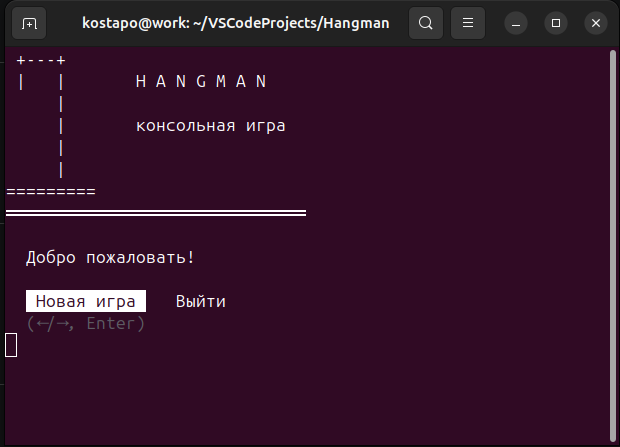
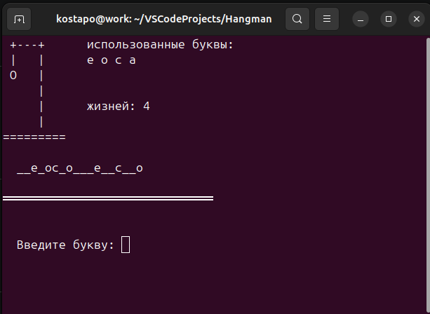
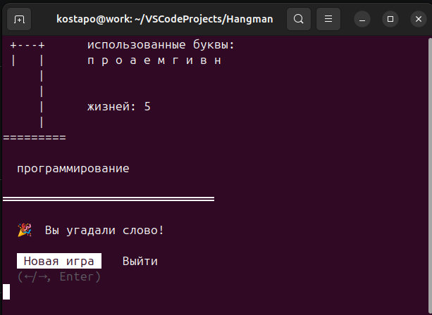
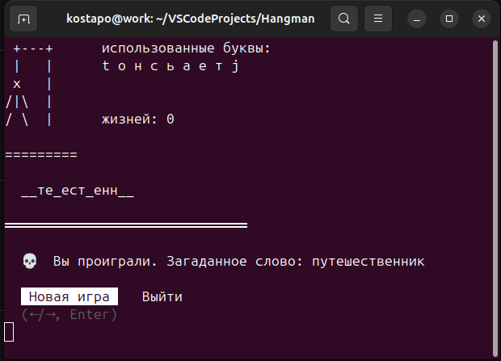

# 🪢 Hangman

<h3>Консольная игра «Виселица» на Go.</h3>

При старте, приложение предлагает начать новую игру или выйти из приложения. В начале новой игры, случайным образом загадывается слово, и игрок начинает процесс по его отгадыванию.После каждой введенной буквы в консоль выводится текущее состояние игры в котором счётчик ошибок, использованные буквы, маска загаданного слова и состояние виселицы (нарисованное ASCII символами). По завершении игры вывод результат (победа или поражение) и возвращаемся к состоянию




## Игровой процесс







## Быстрый запуск

```bash
git clone https://github.com/KostaPo/go-hangman.git
cd go-hangman
go run ./cmd/hangman/main.go
```

## Установка и запуск

### Linux
```bash
git clone https://github.com/KostaPo/go-hangman.git
cd go-hangman
go build -o hangman ./cmd/hangman
./hangman
```

### Windows
```bash
git clone https://github.com/KostaPo/go-hangman.git
cd go-hangman
set CGO_ENABLED=0 && set GOOS=windows && set GOARCH=amd64 && go build -o hangman.exe ./cmd/hangman
hangman.exe
```

## Требования

- Go 1.21+

## Стек

- Go
- [golang.org/x/term](https://pkg.go.dev/golang.org/x/term) — работа с терминалом